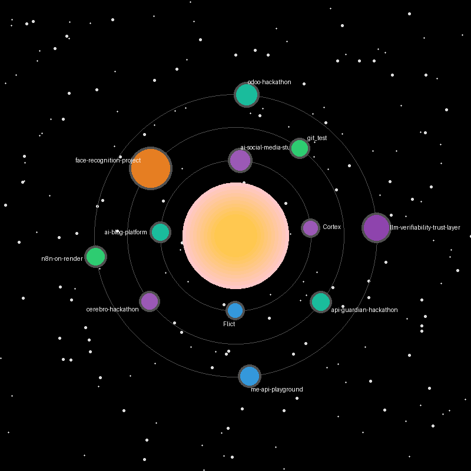

# Hi, I'm Dev Sharma 

I'm a Computer Science student specializing in Artificial Intelligence & Machine Learning at Manipal University Jaipur.

I enjoy building intelligent systems, backend platforms, and developer tools that combine AI models with scalable software architecture.

My work often focuses on:
- AI systems & LLM infrastructure
- backend architecture and APIs
- automation and developer productivity tools
- data-driven intelligent platforms

I like exploring how machine learning systems interact with real-world software systems, not just models in isolation.

---

## Connect with me

**Email**: sdev43083@gmail.com  
**LinkedIn**: https://www.linkedin.com/in/dev-sharma-1184a8281/

---

# My Coding Universe

Each planet represents one of my repositories.

  

### Universe Legend

> [!NOTE]  
> Each planet represents one of my repositories  
> Planet size is proportional to project activity (based on commits)  
> Planet color is based on the technical domain of the project

---

# Technical Domains (Planet Colors)

### Artificial Intelligence
Projects involving intelligent systems, LLM applications, and AI infrastructure.

Includes:
- LLM systems
- NLP
- Generative AI
- AI orchestration
- Multi-agent reasoning
- AI APIs and pipelines

---

### Machine Learning
Projects focused on model training, prediction systems, and ML pipelines.

Includes:
- Supervised learning
- Regression and forecasting
- Recommender systems
- Model evaluation
- Feature engineering

---

### Computer Vision
Projects that analyze and process images or video.

Includes:
- Facial recognition
- Image processing
- Visual detection systems

---

### Full Stack Development
Projects focused on web platforms and frontend-backend integration.

Includes:
- REST APIs
- Web apps
- Backend services

---

### DevOps / Automation
Projects related to infrastructure, workflows, and automation systems.

Includes:
- Deployment pipelines
- Automation platforms
- Containerized tools

---

# Technologies I Work With

### Programming

Python | C++ | SQL | TypeScript | JavaScript | HTML | CSS

### AI & Machine Learning

Machine Learning | Deep Learning | NLP | Recommender Systems | LLM Systems | Explainable AI

### Frameworks & Tools

Flask | FastAPI | React | Next.js | Streamlit | LangChain | Transformers | Scikit-learn | Pandas | NumPy

### Infrastructure & Dev

Docker | Git | Redis | Google Cloud | AWS | Azure

---

# Current Interests

Right now I'm exploring:

- **LLM infrastructure and AI tooling**
- **Multi-agent AI systems**
- **AI-assisted developer tools**

---

<!--
Future improvement:
Replace the legend section with a more visual explanation
(e.g., a mini diagram or color swatches).
-->